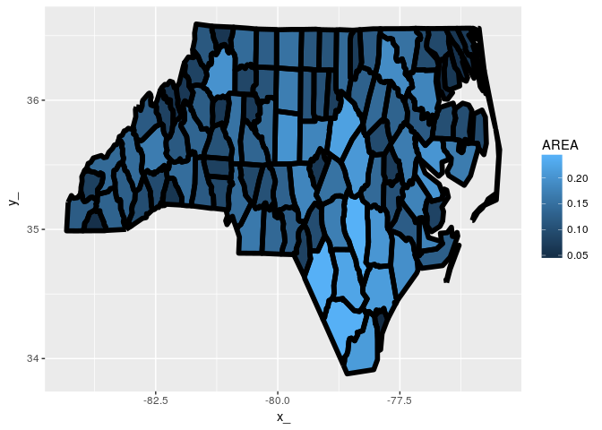
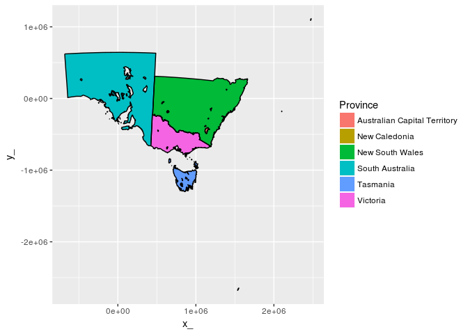
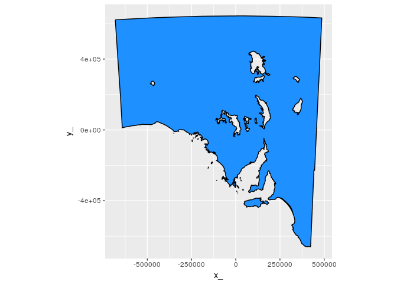

<!-- README.md is generated from README.Rmd. Please edit that file -->
[](https://travis-ci.org/mdsumner/scsf) [](https://ci.appveyor.com/project/mdsumner/scsf) [](https://codecov.io/github/mdsumner/scsf?branch=master)

scsf
====

Convert simple features to a generic common form that is more general and can be used for a wide variety of data structures.

This is *work in progress* and at a very early stage. More to come.

Example - sf to ggplot2 round trip
----------------------------------

``` r
library(sf)
#> Linking to GEOS 3.5.1, GDAL 2.1.2, proj.4 4.9.3
## a MULTIPOLYGON layer
nc = st_read(system.file("shape/nc.shp", package="sf"))
#> Reading layer `nc' from data source `/usr/local/lib/R/site-library/sf/shape/nc.shp' using driver `ESRI Shapefile'
#> converted into: POLYGON
#> Simple feature collection with 100 features and 14 fields
#> geometry type:  MULTIPOLYGON
#> dimension:      XY
#> bbox:           xmin: -84.32385 ymin: 33.88199 xmax: -75.45698 ymax: 36.58965
#> epsg (SRID):    4267
#> proj4string:    +proj=longlat +datum=NAD27 +no_defs
```

The common form is the entity tables, objects, paths, vertices and a link table to allow de-duplication of shared vertices. Currently this de-duplication is done on all coordinate fields, but for most applications it will usually be done only in X-Y.

``` r
library(scsf)
#> Loading required package: sc
nc = st_read(system.file("gpkg/nc.gpkg", package="sf"))
#> Reading layer `nc.gpkg' from data source `/usr/local/lib/R/site-library/sf/gpkg/nc.gpkg' using driver `GPKG'
#> converted into: MULTIPOLYGON
#> Simple feature collection with 100 features and 14 fields
#> geometry type:  MULTIPOLYGON
#> dimension:      XY
#> bbox:           xmin: -84.32385 ymin: 33.88199 xmax: -75.45698 ymax: 36.58965
#> epsg (SRID):    4267
#> proj4string:    +proj=longlat +datum=NAD27 +no_defs


(bmodel <- PATH(nc))
#> $object
#> # A tibble: 100 x 15
#>     AREA PERIMETER CNTY_ CNTY_ID        NAME   FIPS FIPSNO CRESS_ID BIR74
#>    <dbl>     <dbl> <dbl>   <dbl>      <fctr> <fctr>  <dbl>    <int> <dbl>
#>  1 0.114     1.442  1825    1825        Ashe  37009  37009        5  1091
#>  2 0.061     1.231  1827    1827   Alleghany  37005  37005        3   487
#>  3 0.143     1.630  1828    1828       Surry  37171  37171       86  3188
#>  4 0.070     2.968  1831    1831   Currituck  37053  37053       27   508
#>  5 0.153     2.206  1832    1832 Northampton  37131  37131       66  1421
#>  6 0.097     1.670  1833    1833    Hertford  37091  37091       46  1452
#>  7 0.062     1.547  1834    1834      Camden  37029  37029       15   286
#>  8 0.091     1.284  1835    1835       Gates  37073  37073       37   420
#>  9 0.118     1.421  1836    1836      Warren  37185  37185       93   968
#> 10 0.124     1.428  1837    1837      Stokes  37169  37169       85  1612
#> # ... with 90 more rows, and 6 more variables: SID74 <dbl>, NWBIR74 <dbl>,
#> #   BIR79 <dbl>, SID79 <dbl>, NWBIR79 <dbl>, object_ <chr>
#> 
#> $path
#> # A tibble: 108 x 4
#>    island_ ncoords_    path_  object_
#>      <chr>    <int>    <chr>    <chr>
#>  1       1       27 5158bdd0 3b20ddbe
#>  2       1       26 40c12557 0611936a
#>  3       1       28 b86f5c71 24bc62c4
#>  4       1       26 be286e9e ab8800e4
#>  5       2        7 b7b2569c ab8800e4
#>  6       3        5 77928a14 ab8800e4
#>  7       1       34 5ad29198 bc12cc80
#>  8       1       22 24015730 a6acd36f
#>  9       1       24 6e4d0a85 83a8ade4
#> 10       1       17 a16a1199 9d81630b
#> # ... with 98 more rows
#> 
#> $vertex
#> # A tibble: 1,255 x 3
#>           x_       y_  vertex_
#>        <dbl>    <dbl>    <chr>
#>  1 -81.47276 36.23436 08ac03c4
#>  2 -81.54084 36.27251 afc812ed
#>  3 -81.56198 36.27359 85c4f41e
#>  4 -81.63306 36.34069 6b96123b
#>  5 -81.74107 36.39178 3a8a2ac9
#>  6 -81.69828 36.47178 5d279c43
#>  7 -81.70280 36.51934 1f93c65d
#>  8 -81.67000 36.58965 5c027c26
#>  9 -81.34530 36.57286 9f612a09
#> 10 -81.34754 36.53791 9d99a751
#> # ... with 1,245 more rows
#> 
#> $path_link_vertex
#> # A tibble: 2,529 x 2
#>       path_  vertex_
#>       <chr>    <chr>
#>  1 5158bdd0 08ac03c4
#>  2 5158bdd0 afc812ed
#>  3 5158bdd0 85c4f41e
#>  4 5158bdd0 6b96123b
#>  5 5158bdd0 3a8a2ac9
#>  6 5158bdd0 5d279c43
#>  7 5158bdd0 1f93c65d
#>  8 5158bdd0 5c027c26
#>  9 5158bdd0 9f612a09
#> 10 5158bdd0 9d99a751
#> # ... with 2,519 more rows
#> 
#> attr(,"class")
#> [1] "PATH" "sc"  
#> attr(,"join_ramp")
#> [1] "object"           "path"             "path_link_vertex"
#> [4] "vertex"
```

Prove that things work by round-tripping to the PATH model and onto the old fortify approach for `ggplot2`.

``` r
inner_cascade <- function(x) {
  tabnames <- sc:::join_ramp(x)
  tab <- x[[tabnames[1]]]
  for (ni in tabnames[-1L]) tab <- dplyr::inner_join(tab, x[[ni]])
  tab
}

## this just joins everything back together in one big fortify table
library(dplyr)
#> 
#> Attaching package: 'dplyr'
#> The following objects are masked from 'package:stats':
#> 
#>     filter, lag
#> The following objects are masked from 'package:base':
#> 
#>     intersect, setdiff, setequal, union
tab <- bmodel  %>% inner_cascade()
#> Joining, by = "object_"
#> Joining, by = "path_"
#> Joining, by = "vertex_"

library(ggplot2)
ggplot(tab) + aes(x = x_, y = y_, group = path_) + 
  geom_polygon(aes(fill = AREA)) +  geom_path(lwd = 2, col = "black") 
```



What about polygons with holes and lots of tiny complicated parts.

``` r
data("inlandwaters")

iw <- PATH(inlandwaters)

str(iw)
#> List of 4
#>  $ object          :Classes 'tbl_df', 'tbl' and 'data.frame':    6 obs. of  3 variables:
#>   ..$ ID      : int [1:6] 103841 103842 103843 103846 103847 103848
#>   ..$ Province: chr [1:6] "Australian Capital Territory" "New Caledonia" "New South Wales" "South Australia" ...
#>   ..$ object_ : chr [1:6] "2781a28b" "8b88b2db" "6d35fc27" "87de1dd4" ...
#>   ..- attr(*, "sf_column")= chr "geom"
#>   ..- attr(*, "agr")= Factor w/ 3 levels "constant","aggregate",..: NA NA
#>   .. ..- attr(*, "names")= chr [1:2] "ID" "Province"
#>  $ path            :Classes 'tbl_df', 'tbl' and 'data.frame':    189 obs. of  4 variables:
#>   ..$ island_ : chr [1:189] "1" "1" "1" "1" ...
#>   ..$ ncoords_: int [1:189] 280 27 7310 68 280 88 162 119 51 71 ...
#>   ..$ path_   : chr [1:189] "8b79cd53" "8e7e79b1" "4f21921e" "767b69b9" ...
#>   ..$ object_ : chr [1:189] "2781a28b" "8b88b2db" "6d35fc27" "6d35fc27" ...
#>  $ vertex          :Classes 'tbl_df', 'tbl' and 'data.frame':    30835 obs. of  3 variables:
#>   ..$ x_     : num [1:30835] 1116371 1117093 1117172 1117741 1117629 ...
#>   ..$ y_     : num [1:30835] -458419 -457111 -456893 -456561 -455510 ...
#>   ..$ vertex_: chr [1:30835] "5fac24cf" "b1394465" "60d9a8b1" "22c4cdf3" ...
#>  $ path_link_vertex:Classes 'tbl_df', 'tbl' and 'data.frame':    33644 obs. of  2 variables:
#>   ..$ path_  : chr [1:33644] "8b79cd53" "8b79cd53" "8b79cd53" "8b79cd53" ...
#>   ..$ vertex_: chr [1:33644] "5fac24cf" "b1394465" "60d9a8b1" "22c4cdf3" ...
#>  - attr(*, "class")= chr [1:2] "PATH" "sc"
#>  - attr(*, "join_ramp")= chr [1:4] "object" "path" "path_link_vertex" "vertex"

tab <- iw  %>% inner_cascade()
#> Joining, by = "object_"
#> Joining, by = "path_"
#> Joining, by = "vertex_"

library(ggplot2)
ggplot(tab) + aes(x = x_, y = y_, group = path_) + 
  ggpolypath::geom_polypath(aes(fill = Province)) +  geom_path(col = "black") 
```



``` r

ggplot(tab %>% filter(Province == "South Australia")) + aes(x = x_, y = y_, group = path_) + 
  ggpolypath::geom_polypath(fill = "dodgerblue") +  geom_path(col = "black") + coord_fixed()
```


